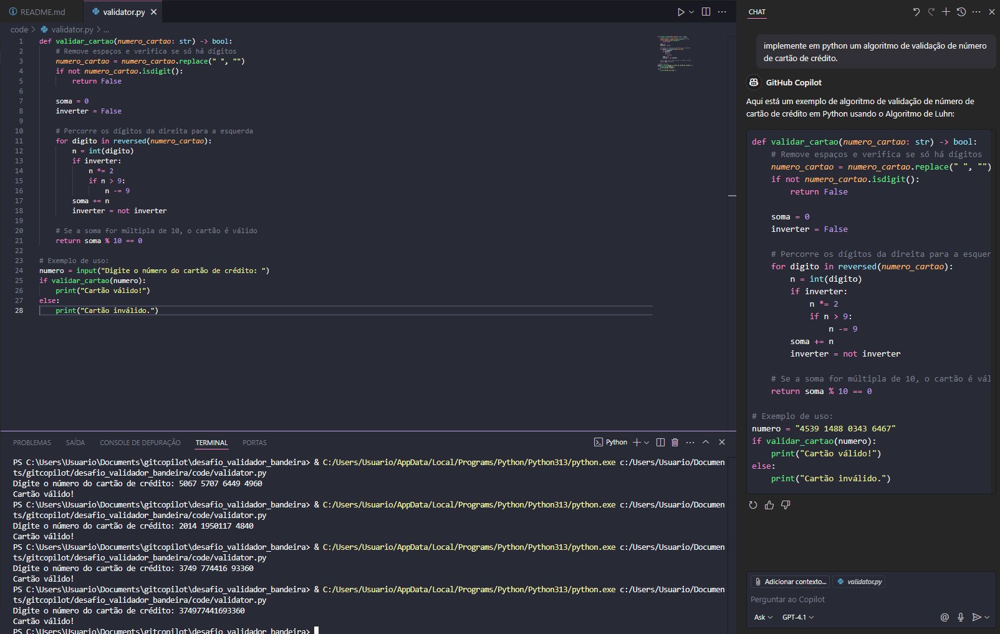
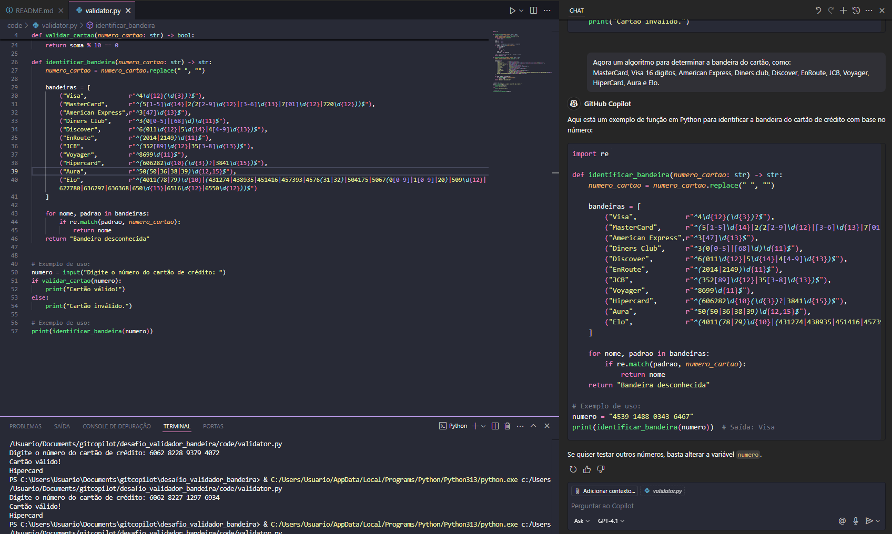
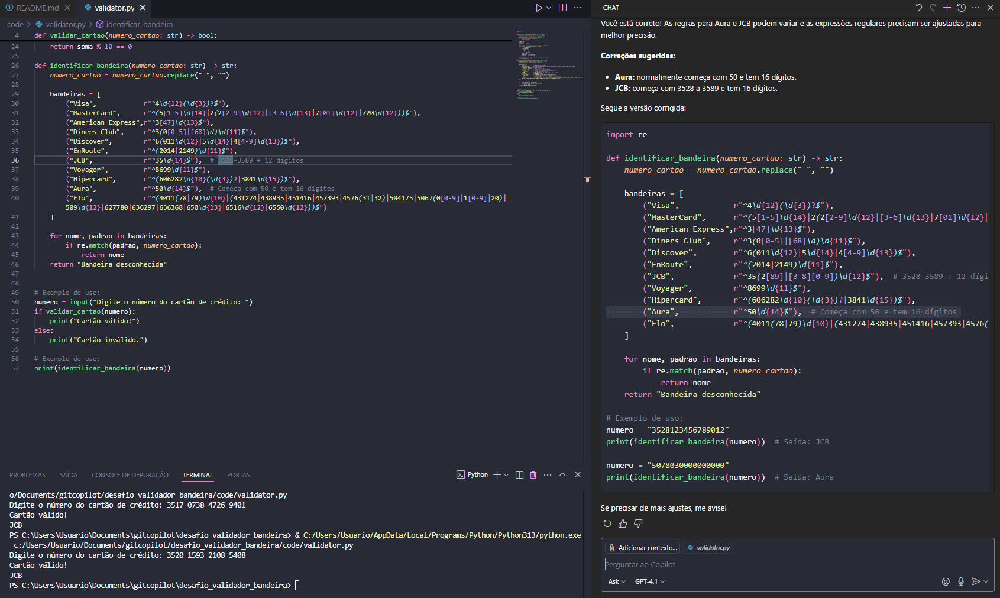

# Desafio Validador de Bandeira de Cartão

Este projeto é um desafio que utiliza o GitHub Copilot para implementar, em Python, um validador de números de cartão de crédito, identificando automaticamente a bandeira (Visa, MasterCard, etc.) com base no número informado.

## Instalação

```bash
# Clone o repositório
git clone https://github.com/henriquef9/desafio_validador_bandeira.git
cd desafio_validador_bandeira

# (Recomendado) Crie um ambiente virtual
python -m venv venv
# Ative o ambiente virtual
source venv/bin/activate  # No Windows: venv\Scripts\activate

# Instale as dependências
pip install -r requirements.txt
```

## Uso

```bash
# Execute o validador
python main.py
```

## Exemplos de Uso do Copilot

Abaixo estão três imagens demonstrando interações com o GitHub Copilot durante o desenvolvimento:





## Funcionalidades

- Validação de números de cartão de crédito
- Identificação automática da bandeira do cartão (Visa, MasterCard, etc.)
- Mensagens de erro para números inválidos

## Contribuição

1. Faça um fork deste repositório
2. Crie uma branch (`git checkout -b feature/nova-feature`)
3. Commit suas mudanças (`git commit -m 'Adiciona nova feature'`)
4. Push para o branch (`git push origin feature/nova-feature`)
5. Abra um Pull Request

## Licença

Este projeto está licenciado sob a licença MIT.